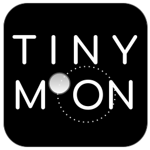
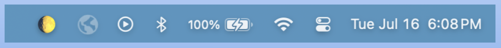
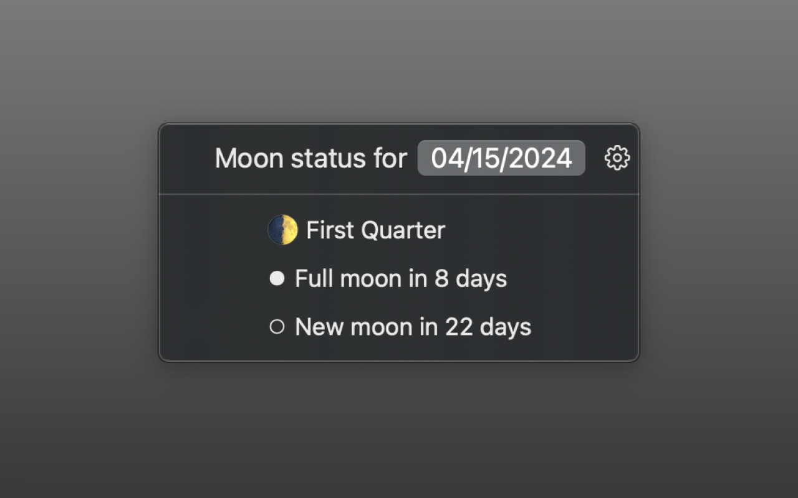
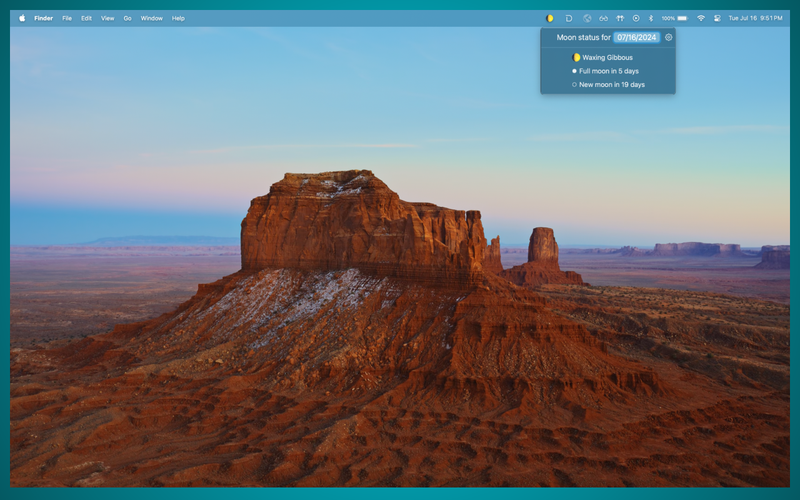

# Tiny Moon, a MacOS app

[Available on the App Store](https://apps.apple.com/us/app/tiny-moon/id6502374344?mt=12)

Current moon phase lives as an emoji in your toolbar. Updates daily and works completely offline.

Uses the [Tiny Moon](https://github.com/mannylopez/TinyMoon) Package.

